<div align="center">

# K League Pass End-Point Prediction

### 🥈 2nd place · Gold Award (금상)

DACON · K League × University of Seoul Open AI Competition (K리그-서울시립대 공개 AI 경진대회) — Track 1: Algorithm

**Dense-supervised BiLSTM + heatmap CNN with fine-grid residual decoding**

[](#getting-started)
[](https://pytorch.org/)
[](https://scikit-learn.org/)
[](LICENSE)
[](https://dacon.io/competitions/official/236647/overview/description)

</div>

Given the sequence of on-ball events that leads up to a pass in a K League match, predict **where that final pass ends**: its `(end_x, end_y)` on a 105 × 68 m pitch. Predictions are scored by the Euclidean distance to the true end point.

This repository contains the final (v7) solution of team **J_hyuk** (Jae-Hyuk Jang, 장재혁). It finished **2nd and won the Gold Award** in a competition with 1,806 participants, with a private leaderboard error of **12.569 m**. The model is a multi-task sequence network that pairs a possession-aware BiLSTM with a spatial heatmap CNN and a hybrid regression + classification output head. It is trained with dense per-pass supervision and deployed as a 5-fold ensemble.

## Highlights

- **Possession-aware inputs in a unified frame.** Every episode is re-expressed from the point of view of the team making the pass. The BiLSTM reads the current possession, while an 8-channel heatmap keeps the whole-episode context.
- **Dense supervision.** Every pass in an episode becomes a training target, not only the last one. A last-pass-only fine-tuning stage follows.
- **Hybrid output with a learned blend.** A coarse offset regressor and a 24 × 16 fine-cell classifier with in-cell residual regression, mixed by a learned gate α.
- **Metric-aligned decoding.** The same differentiable top-K expected-position decoder is used in the training loss and at inference, so the loss contains the competition metric itself.
- **Leakage-safe validation.** GroupKFold by match, with every fitted preprocessing step (normalization, scalers, three KMeans models) refit inside each fold.
- **Robust training & inference.** Spatial soft labels, mirror augmentation, EMA, AMP, mirror TTA, and an inverse-CV-weighted 5-fold ensemble.
- **Reproducible packaging.** One core module shared by training and inference, fold artifacts that carry their own preprocessing state, seed/determinism controls, and an environment snapshot.

## Results

| Evaluation | Mean Euclidean distance (m) ↓ |
|---|---:|
| 5-fold CV: single models on the last pass (mean ± std) | **12.8585 ± 0.0950** |
| Public leaderboard: 5-fold ensemble + mirror TTA | **12.45** |
| Private leaderboard: 5-fold ensemble + mirror TTA | **12.56885** |

**Final standing: 2nd place, Gold Award (금상)**, out of 1,806 participants ([DACON leaderboard](https://dacon.io/competitions/official/236647/leaderboard)).

<p align="center">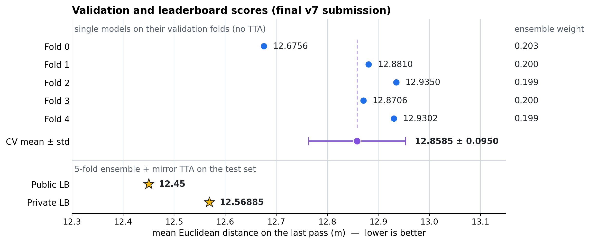</p>

- **Stable folds.** The five fold scores lie within 0.26 m of each other (12.68 – 12.94 m), and the standard deviation is 0.74 % of the mean. The GroupKFold-by-match validation behaved consistently.
- **Near-uniform ensemble.** Because the fold scores are so close, the 1 / CV weights end up between 0.199 and 0.203, so the ensemble is almost a plain average of the five models.
- **Different settings.** Fold scores come from single models on their own validation folds without TTA. The leaderboard scores come from the full 5-fold ensemble with mirror TTA on the hidden test set.

<details>
<summary><b>Per-fold scores</b> (final training log)</summary>

| Fold | Best validation distance on last passes (m) | Ensemble weight ∝ 1 / score |
|---|---:|---:|
| 0 | 12.6756 | 0.203 |
| 1 | 12.8810 | 0.200 |
| 2 | 12.9350 | 0.199 |
| 3 | 12.8706 | 0.200 |
| 4 | 12.9302 | 0.199 |
| **mean ± std** | **12.8585 ± 0.0950** | |

</details>

## Contents

- [Problem](#problem)
- [Data insights & challenges](#data-insights--challenges)
- [Solution at a glance](#solution-at-a-glance)
- [Preprocessing & feature engineering](#preprocessing--feature-engineering)
- [Dense supervision](#dense-supervision)
- [Model architecture](#model-architecture)
- [Decoding: top-K expected end point](#decoding-top-k-expected-end-point)
- [Training](#training)
- [Inference](#inference)
- [Repository structure](#repository-structure)
- [Getting started](#getting-started)
- [Reproducibility](#reproducibility)
- [Troubleshooting](#troubleshooting)

## Problem

- **Input**: one *episode*, a time-ordered sequence of on-ball events (passes and other actions) with event type and result, team, player, timestamps, and start/end coordinates.
- **Target**: `(end_x, end_y)` of the episode's final pass, whose end point is hidden in the test files.
- **Coordinates**: relative coordinates on a 105 × 68 grid (the FIFA-recommended pitch size), which removes stadium-size differences.
- **Metric**: Euclidean distance between predicted and true end points, averaged over episodes (lower is better).

The data is distributed by DACON and is **not included** in this repository.

| File | Content |
|---|---|
| `train.csv` | Event rows of all training episodes. Columns used here: `game_id`, `game_episode`, `time_seconds`, `period_id`, `team_id`, `player_id`, `action_id`, `type_name`, `result_name`, `start_x`, `start_y`, `end_x`, `end_y`, `is_home` |
| `test.csv` | `game_episode` → `path` of the episode file |
| `test/{game_id}/{game_id}_{episode}.csv` | One test episode per file; the last event's end point is the target |
| `sample_submission.csv` | `game_episode, end_x, end_y` |

## Data insights & challenges

<p align="center">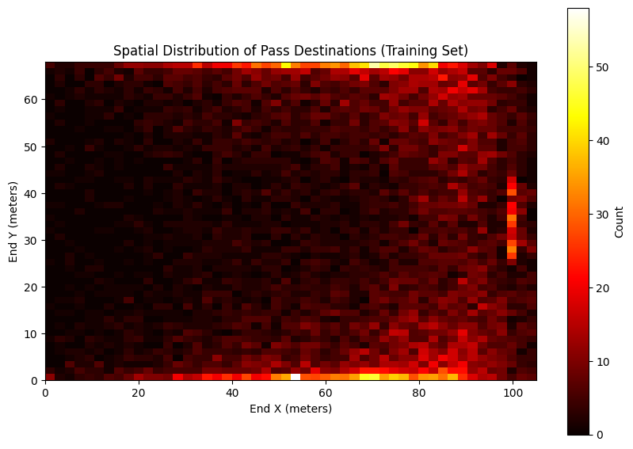</p>

**Pass destinations are far from uniform.** In the training set they pile up along both touchlines and along the front edge of the goal area (x ≈ 100 m, y ≈ 25 – 43 m), and they are denser in the attacking half. A grid classifier can represent sharp, non-Gaussian patterns like these directly, while a single regression output cannot.

<p align="center">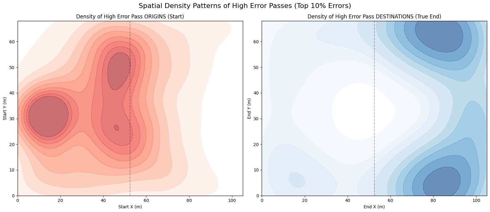</p>

**The largest errors come from long, wide passes.** For the 10 % of passes with the highest error, the start points cluster in the defensive third and around the halfway line, while the true end points cluster in the wide channels of the attacking third. These are long balls with several plausible targets, where an averaging regressor tends to land in between.

Together with the structure of the data, this leads to three core challenges and the components that address them:

| Challenge | How the solution addresses it |
|---|---|
| Episodes vary widely in length (e.g. 10 vs. 81 events), and events of both teams are recorded in their own attacking directions | Coordinate unification to the passer's team; a possession window of ≤ 40 steps with a packed BiLSTM; a heatmap that summarizes the full prefix |
| The target is the "future" step: its own end point, and every feature derived from it, is unknown | Movement features of the target step are masked and the heatmap only uses its start. Dense supervision trains on every pass; Stage 2 fine-tunes on last passes |
| Plain regression errs most on long passes into far or rare areas | 24 × 16 fine-grid classification + in-cell residual, top-K expected decoding, a gate that falls back to regression when unsure, and spatial soft labels |

## Solution at a glance

<p align="center">
  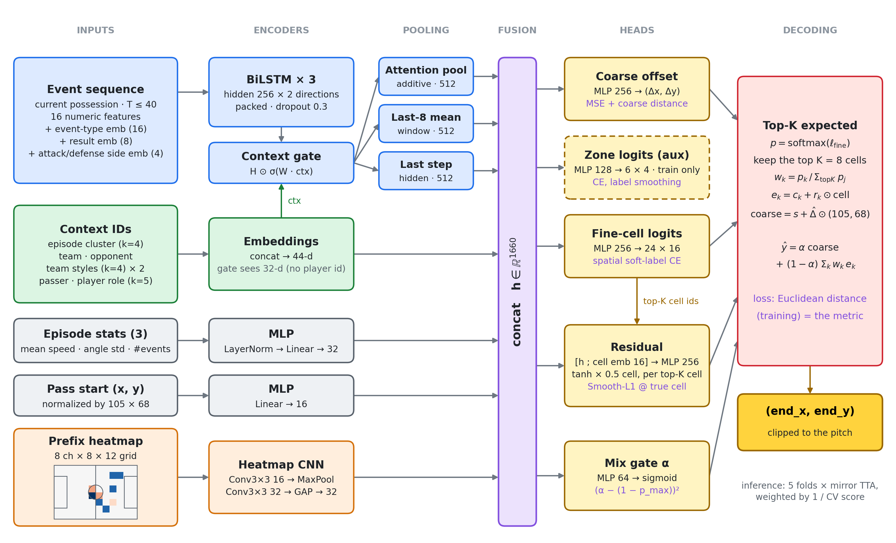
</p>

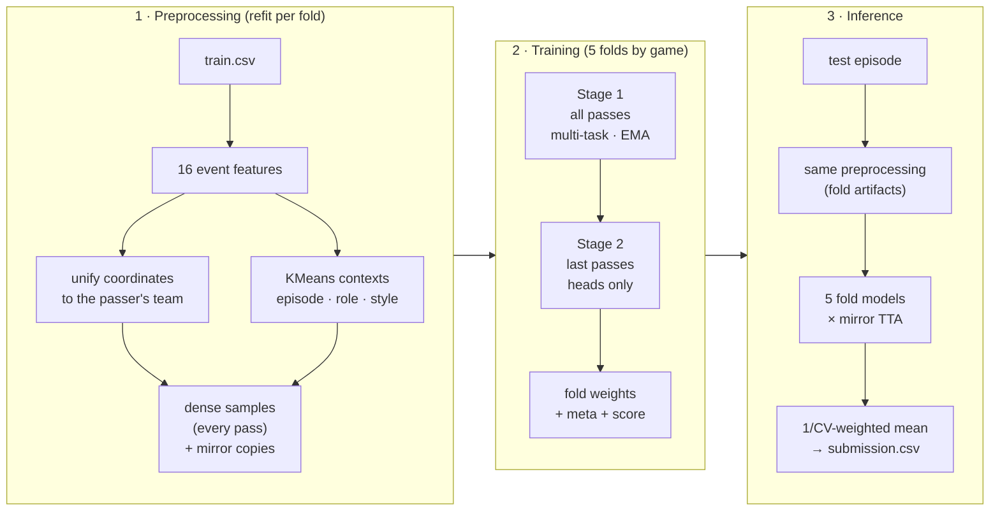

> The results chart and EDA plots above use real competition scores and data. The method figures below are **schematic**: they are drawn from a hand-made episode, but every transform in them is computed with the functions in `kleague_v7_core.py`. See [`docs/make_figures.py`](docs/make_figures.py).

## Preprocessing & feature engineering

### 1. Coordinate unification

<p align="center">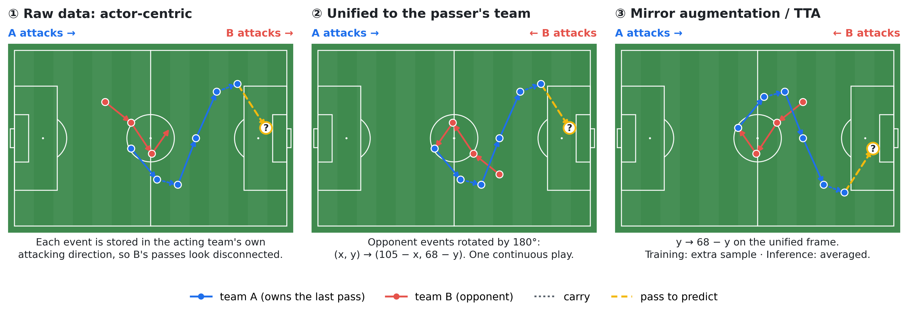</p>

The provided coordinates are team-centric: every event is recorded in the acting team's own attacking direction (toward x = 105). Read naively, an episode with a turnover jumps between two incompatible frames. For every sample, the pipeline picks a **reference team**, the team that makes the pass being predicted, and rotates the opponent's events by 180° (`align_episode_to_ref_team`). The whole episode then reads as one continuous play in the reference team's frame. Because unified sequences mix original and rotated events, the feature normalization statistics are computed on a 50/50 mix of original and fully rotated data (`compute_seq_feature_norm_stats_mixed`). Panel ③ shows the y-mirror used for augmentation and test-time augmentation (TTA).

### 2. Event features

Each event is described by 16 numeric features (z-scored with fold-local statistics) and three per-step embeddings:

| Group | Features |
|---|---|
| Position | `start_x`, `start_y` |
| Movement | `pass_dx`, `pass_dy`, `pass_dist`, `speed` (= dist / dt), `angle`, `angle_diff` (change of direction) |
| Timing | `dt` (clipped at ≥ 0.05 s), `rel_time` (0 – 1 within the episode), `idx_from_end_norm` |
| Match context | `is_home`, `period_id` |
| Goal geometry | `dist_goal_start`, `angle_to_goal` (to the goal center at (105, 34)), `in_box_start` (inside the 16.5 m × 40.32 m box) |
| Embeddings | event type (16-d), result (8-d, missing → `Unknown`), attacking/defending side relative to the reference team (4-d) |

Unseen categories map to a dedicated *unknown* index.

### 3. Possession window and target masking

- **Current possession only.** The BiLSTM sees the events since the reference team last gained the ball (`last_possession_start_index`), capped at the last 40 events. If that window is shorter than two events, it falls back to the full prefix.
- **No answer leakage at the target step.** The six movement features of the target event (`pass_dx`, `pass_dy`, `pass_dist`, `speed`, `angle`, `angle_diff`) are derived from the end point being predicted, so they are reset to the normalized equivalent of 0. The heatmap likewise uses only the target's start location.

### 4. Context features (KMeans)

| Context | Built from | Enters the model as |
|---|---|---|
| Episode style (k = 4) | standardized mean speed, std of direction change, and number of events of the build-up (all events except the last) | cluster embedding (4-d) + the three scaled statistics through an MLP |
| Player role (k = 5) | per-player means: start x/y, distance to goal, pass length, share of events in the box, speed, share of forward actions (dx > 0) | embedding (4-d) of the passer's role |
| Team style (k = 4) | the same statistics aggregated per team | embeddings (4-d) for the team and its opponent |
| Identities | team and opponent (8-d each), passer (12-d) | embeddings |

The three KMeans models and their scalers are fit on the training split of each fold only and saved to `meta_fold{i}.pkl`. At inference, players or teams absent from the training split get a role/style predicted from the test episode's own events with the same fold models.

### 5. Prefix heatmap

<p align="center">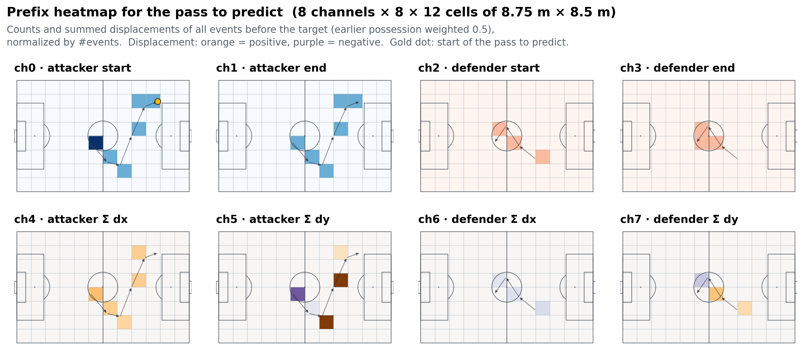</p>

A 12 × 8 grid (8.75 m × 8.5 m cells) summarizes everything that happened before the target, split by side. For both the attacking and the defending team it stores start counts, end counts, and summed displacement (dx / 105, dy / 68, accumulated at the start cell), giving 8 channels. Events from before the current possession are down-weighted to 0.5, the target contributes only its start location, and the map is divided by the number of events (`build_episode_heatmap_prefix`). The heatmap carries the whole-episode spatial context that the possession-limited BiLSTM does not see.

## Dense supervision

<p align="center">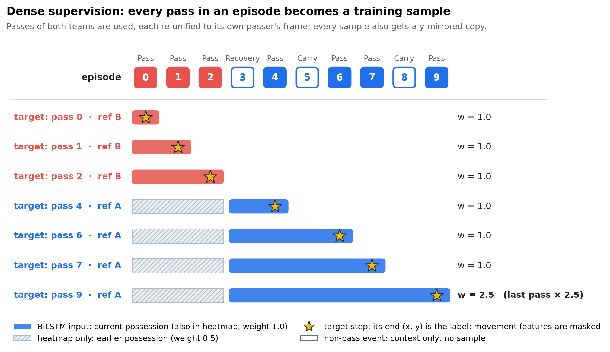</p>

Instead of one sample per episode (its last pass), `build_dense_train_samples` creates a sample for **every pass** of either team (`train_only_pass_targets=True`). Each sample is re-unified to its own passer's frame and gets its own possession window, heatmap, context IDs, and targets. This multiplies the training signal for the sequence encoder.

- The last pass of each episode, which is the situation evaluated at test time, has sample weight **×2.5**.
- Validation and checkpoint selection use **last passes only**, which mirrors the competition setting.

## Model architecture

`PassLSTMDenseHeatmapFineResidualMTL` has ≈ 5.6 M parameters. The exact count depends on the player/team vocabulary, but the embeddings are small.

| Block | Details | Output |
|---|---|---|
| Per-step input | 16 features ⊕ type emb (16) ⊕ result emb (8) ⊕ side emb (4) | 44 per step |
| BiLSTM | 3 layers, hidden 256 per direction, dropout 0.3, packed variable-length sequences | T × 512 |
| Context gate | `H ⊙ σ(W · ctx)` with ctx = episode cluster, team, opponent, both team styles, player role (32-d) | T × 512 |
| Pooling | additive attention (dim 64) · mean of the last 8 steps · last valid step | 3 × 512 |
| Context embeddings | cluster 4 + team 8 × 2 + team style 4 × 2 + player 12 + player role 4 | 44 |
| Episode-stats MLP | LayerNorm → Linear → ReLU | 32 |
| Pass-start MLP | (x / 105, y / 68) → Linear → ReLU | 16 |
| Heatmap CNN | Conv3×3 (8→16) → ReLU → MaxPool 2 → Conv3×3 (16→32) → ReLU → global average pool | 32 |
| **Fusion `h`** | concatenation of all of the above | **1660** |

Each head is `LayerNorm → Linear → ReLU → Dropout(0.3) → Linear`, applied to `h` (the residual head takes `[h ; cell embedding]`):

| Head | Output | Purpose | Loss |
|---|---|---|---|
| Coarse offset | (Δx / 105, Δy / 68) | direct regression from the pass start | MSE + coarse distance |
| Zone (auxiliary) | 24 logits (6 × 4 grid) | coarse classification that shapes `h`; unused at inference | CE, label smoothing 0.03 |
| Fine cell | 384 logits (24 × 16 grid) | distribution over where the pass ends | spatial soft-label CE |
| Residual | 2 per cell, `tanh × 0.5` (cell units) | sub-cell offset from `[h ; cell embedding (16)]` | Smooth-L1 at the true cell |
| Mix gate | α ∈ (0, 1) | blends the coarse and fine predictions | (α − (1 − p_max))² |

## Decoding: top-K expected end point

<p align="center">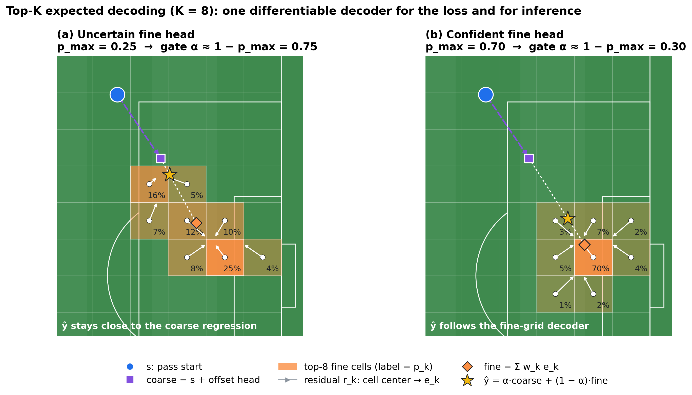</p>

```math
\hat{\mathbf{y}} = \alpha\,\underbrace{\big(\mathbf{s} + \hat{\boldsymbol{\Delta}} \odot (105,\,68)\big)}_{\text{coarse}} \;+\; (1-\alpha) \sum_{k \in \text{top-}K} w_k \underbrace{\big(\mathbf{c}_k + \mathbf{r}_k \odot (4.375,\,4.25)\big)}_{\text{fine candidate } \mathbf{e}_k}, \qquad w_k = \frac{p_k}{\sum_{j \in \text{top-}K} p_j}
```

1. `p = softmax(fine logits)` over the 384 cells. Keep the K = 8 most likely cells and renormalize their probabilities to `w_k`.
2. For each candidate cell, the residual head predicts an in-cell offset `r_k ∈ [−0.5, 0.5]²`, conditioned on that cell's embedding. The candidate end point is `e_k = center_k + r_k ⊙ cell size`.
3. The gate blends the regression estimate `coarse = s + Δ ⊙ (105, 68)` with the expected fine point. Since α is shared across candidates, `ŷ = α · coarse + (1 − α) · Σ w_k e_k`.

**Rationale.** A pure regressor averages multimodal outcomes (say, a cross versus a cut-back) into an implausible middle point. The classifier keeps the modes, the residual restores sub-cell precision, and the gate, regularized toward `1 − p_max`, falls back to regression when the classifier is unsure. Decoding from the argmax cell alone would turn every misclassified cell into a large jump, while the expectation over the top-K cells degrades gracefully. The decoder is differentiable, and the same computation is used in the distance loss and at inference (`predict_end_topk_expected_train` / `_eval`), so there is no train/inference mismatch.

> **Lesson from earlier versions.** Earlier versions measured the training distance with the residual applied at the ground-truth cell. This teacher-forcing mismatch made only the training distance drop abnormally low. In v7 the distance loss and the validation metric are always computed inference-style, through the top-K expected decoder, while the residual head keeps its stable ground-truth-cell supervision.

## Training

### Objective

```math
\begin{aligned}
\mathcal{L} = \;& \lambda_{\text{off}}\,\mathrm{MSE}(\hat{\boldsymbol{\Delta}}, \boldsymbol{\Delta})
+ \lambda_{\text{dist}}\,\frac{\lVert \hat{\mathbf{y}} - \mathbf{y} \rVert_2}{40}
+ \lambda_{\text{coarse}}\,\frac{\lVert \hat{\mathbf{y}}_{\text{coarse}} - \mathbf{y} \rVert_2}{40} \\
&+ \lambda_{\text{zone}}\,\mathrm{CE}_{\text{ls}}
+ \lambda_{\text{fine}}\,\mathrm{CE}_{\text{soft}}
+ \lambda_{\text{res}}\,\mathrm{SmoothL1}(\hat{\mathbf{r}}_{c^\ast}, \mathbf{r}^\ast)
+ \lambda_{\text{gate}}\,\big(\alpha - (1 - p_{\max})\big)^2
\end{aligned}
```

Every term is a sample-weighted mean (pass = 1.0, last pass × 2.5). The residual term uses the ground-truth cell `c*` (teacher forcing), while the distance term goes through the full top-K decoder.

| Term | λ, Stage 1 | λ, Stage 2 |
|---|---:|---:|
| Offset MSE | 1.00 | 0.50 |
| Decoded distance / 40 m | 0.35 | 0.55 |
| Zone CE | 0.05 | 0.02 |
| Fine soft-label CE | 0.35 | 0.45 |
| Residual Smooth-L1 | 0.60 | 0.75 |
| Coarse distance / 40 m | 0.08 | 0.08 |
| Gate regularizer | 0.03 | 0.03 |

Stage 2 shifts weight away from the offset MSE and the zone CE toward the decoded distance and the fine/residual heads.

### Spatial soft labels

<p align="center">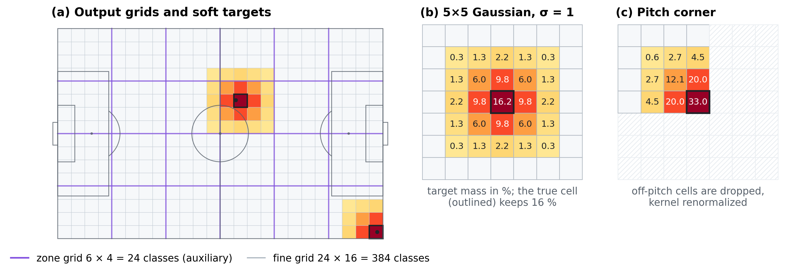</p>

Landing in a neighboring fine cell is off by about 4 m, which is not a total miss. The fine-cell target is therefore a 5 × 5 Gaussian around the true cell (σ = 1 cell) rather than a one-hot vector. Off-pitch neighbors are dropped and the kernel is renormalized (`spatial_soft_ce_loss_vec`).

### Schedule (per fold)

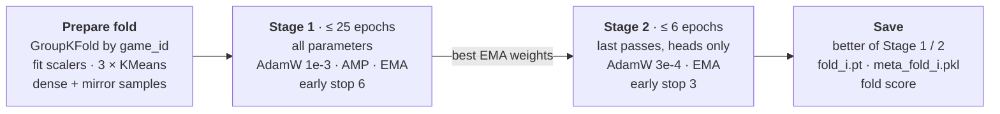

| Setting | Value |
|---|---|
| Cross-validation | 5-fold `GroupKFold` grouped by `game_id`, so a match never appears in both train and validation |
| Validation metric | mean Euclidean distance on last passes, computed with the inference decoder (no TTA) |
| Optimizer | AdamW (lr 1e-3, weight decay 1e-5), gradient-norm clip 1.0, batch 4096, AMP on CUDA |
| LR schedule | `ReduceLROnPlateau` on the validation distance (factor 0.5, patience 2; patience 1 in Stage 2) |
| Early stopping | patience 6 in Stage 1 and 3 in Stage 2, minimum improvement 1e-4 |
| EMA | decay 0.995 with warm-up `d_t = 0.995 · (1 − e^(−t/200))`. Checkpoints store the EMA weights; by default the improvement check uses the live model's score (`eval_use_ema=False`) |
| Mirror augmentation | a y-flipped copy of every sample: flip `start_y`; negate `pass_dy`, `angle`, `angle_diff`, `angle_to_goal`; flip the heatmap and negate its dy channels; recompute the zone, fine-cell, and residual targets |
| Stage 2 | last passes only, backbone frozen (heads + fine-cell embedding train), fresh EMA. Runs when a fold has ≥ 2000 train / 400 validation last passes, and is kept only if it beats Stage 1 |

## Inference

1. Merge `sample_submission.csv` with `test.csv` on `game_episode` and resolve each `path` against `--data_root`.
2. For every episode and every fold, take the team of the last event as the reference team. Build the same unified features, possession window, context IDs, and heatmap as in training, with that fold's normalization statistics and cluster models.
3. Decode with the top-K decoder. With mirror TTA, also predict on the y-flipped input, flip the result back, and average. Clip to the pitch.
4. Average the five folds with weights ∝ 1 / fold score (uniform if `fold_scores.json` is absent).
5. Write `game_episode, end_x, end_y` to `--output_dir`.

If an episode file is missing or empty, that row falls back to the pitch center (52.5, 34.0).

## Repository structure

```
.
├── kleague_v7_core.py      # all ML logic: features, dataset, model, losses, training, inference
├── train.py                # 5-fold CV training entry point (reproducibility toggles, env snapshot)
├── inference.py            # loads fold artifacts and writes the submission CSV
├── requirements.txt        # minimal pinned dependencies
├── requirements_full.txt   # full Google Colab environment snapshot (reference only)
├── docs/
│   ├── make_figures.py     # regenerates the README figures
│   └── figures/            # figures used in this README
├── LICENSE
└── README.md
```

<details>
<summary><b>Code map</b>: where each idea lives in <code>kleague_v7_core.py</code></summary>

| Concept | Function / class |
|---|---|
| Configuration (all hyperparameters) | `CFG`, `build_cfg` |
| Coordinate unification | `align_episode_to_ref_team`, `rotate_180_xy` |
| Event features | `add_event_features_all`, `compute_event_features_single_episode` |
| Normalization | `compute_seq_feature_norm_stats_mixed`, `normalize_seq_block` |
| Context clusters | `compute_episode_stats`, `fit_episode_cluster`, `compute_player_role_clusters`, `compute_team_style_clusters` |
| Possession window & heatmap | `last_possession_start_index`, `build_episode_heatmap_prefix` |
| Dense samples | `build_dense_train_samples` |
| Mirror augmentation / TTA | `augment_samples_mirror_y`, `mirror_inference_pack` |
| Model | `PassLSTMDenseHeatmapFineResidualMTL` |
| Losses | `spatial_soft_ce_loss_vec`, `cross_entropy_with_smoothing`, `train_one_epoch` |
| Decoding | `predict_end_topk_expected_train`, `predict_end_topk_expected_eval` |
| EMA | `ModelEMA` |
| CV training | `train_cv_and_save`, `train_one_fold` |
| Test pipeline | `process_single_episode_for_test`, `predict_test_ensemble_from_artifacts`, `inference_and_save` |

</details>

## Getting started

### 1. Install

```bash
# torch==2.9.0+cu126 is served from the PyTorch index
pip install -r requirements.txt --extra-index-url https://download.pytorch.org/whl/cu126
```

For a CPU-only machine, install PyTorch 2.9 for your platform from [pytorch.org](https://pytorch.org/get-started/locally/), then `numpy`, `pandas`, and `scikit-learn` at the versions in `requirements.txt`. `requirements_full.txt` is the complete Colab environment used for the submission. It is kept for reference and includes Colab-only packages.

### 2. Data

Download the competition files from DACON and place them under `./data`:

```
data/
├── train.csv
├── test.csv
├── sample_submission.csv
└── test/
    └── {game_id}/{game_id}_{episode}.csv
```

`path` values in `test.csv` (for example `./test/...`) are joined to `--data_root` after stripping `./`. Keep the `path` column in `test.csv` only: if `sample_submission.csv` also has one, the merge produces `path_x` / `path_y` and inference fails.

### 3. Train

```bash
python train.py                                # 5 folds → ./weights
python train.py --overwrite                    # replace existing fold*.pt
python train.py --cfg_json weights/cfg.json --weights_dir weights_replay   # replay saved hyperparameters
```

The defaults target a large GPU (batch 4096, up to 25 + 6 epochs per fold). To change hyperparameters, such as `batch_size` on smaller GPUs, edit `CFG` in `kleague_v7_core.py` or pass a modified `cfg.json` via `--cfg_json`.

| Artifact in `weights/` | Content |
|---|---|
| `fold{0..4}.pt` | best state dict per fold (EMA weights) |
| `meta_fold{0..4}.pkl` | fold-local normalization stats, scalers, KMeans models, role/style maps |
| `mappings.pkl`, `mappings.json` | category vocabularies (event type, result, team, player) |
| `cfg.json` | the full hyperparameter set used for training |
| `fold_scores.json` | best validation last-pass distance per fold (used as ensemble weights) |
| `env_info.json` | Python / PyTorch / CUDA / GPU snapshot, written before training starts |

### 4. Predict

Trained weights are not included in this repository. Run `train.py` first, or place the artifacts listed above in `./weights`.

```bash
python inference.py                            # ./data + ./weights → ./output/<submission>.csv
python inference.py --data_root ./data --weights_dir ./weights --output_dir ./output \
                    --submission_filename my_submission.csv
```

If `weights/cfg.json` exists, inference loads its hyperparameters so they match the weights. Paths always come from the command line.

<details>
<summary><b>Command-line options</b></summary>

**`train.py`**

| Flag | Default | Description |
|---|---|---|
| `--data_root` | `./data` | directory containing `train.csv` |
| `--weights_dir` | `./weights` | where fold artifacts are written |
| `--output_dir` | `./output` | kept for symmetry (unused during training) |
| `--device` | auto | `cuda` or `cpu` |
| `--seed` | `42` | random seed (overrides the one in `--cfg_json`) |
| `--cfg_json` | none | load hyperparameters from a saved `cfg.json` |
| `--no_amp` | off | disable mixed precision |
| `--strict_deterministic` | off | `torch.use_deterministic_algorithms(True)` |
| `--deterministic_warn_only` | off | with strict mode, warn instead of raising on non-deterministic ops |
| `--overwrite` | off | allow overwriting existing `fold*.pt` |

**`inference.py`**

| Flag | Default | Description |
|---|---|---|
| `--data_root` | `./data` | directory containing `test.csv`, `sample_submission.csv`, `test/` |
| `--weights_dir` | `./weights` | fold weights and metadata |
| `--output_dir` | `./output` | where the submission CSV is written |
| `--submission_filename` | see below | output file name |
| `--device` | auto | `cuda` or `cpu` |

The default file name, `exp_dense_lstm_heatmap_v7_ema_softlabel_att_side_tta.csv`, spells out the recipe: dense supervision, LSTM + heatmap, v7, EMA, soft labels, attack-side embedding, TTA.

</details>

### 5. Regenerate the figures (optional)

```bash
pip install matplotlib
python docs/make_figures.py                    # method figures + results chart → docs/figures/
```

## Reproducibility

- Seeds for `random`, NumPy, and PyTorch (CPU and CUDA); cuDNN deterministic mode with benchmarking off; TF32 disabled.
- `train.py` also sets `PYTHONHASHSEED` and `CUBLAS_WORKSPACE_CONFIG=:4096:8`. For the strictest runs, export both in the shell before launching Python.
- Deterministic data order: each epoch reshuffles with its own generator seeded from (seed, fold, epoch), with `num_workers=0`.
- Optional strict mode: `python train.py --strict_deterministic --deterministic_warn_only --no_amp`.
- `train.py` switches to its own directory so relative paths always resolve, refuses to overwrite existing weights without `--overwrite`, and writes `env_info.json` before training.
- Bit-identical results across different GPUs or CUDA/cuDNN versions are not guaranteed.

## Troubleshooting

<details>
<summary><b>Common issues</b></summary>

- **`FileNotFoundError: ... fold*.pt / meta_fold*.pkl`**: `--weights_dir` is missing training artifacts. Train first or copy them in.
- **Many predictions equal (52.5, 34.0)**: the episode files were not found. Check that `data/test/` exists, that `path` looks like `./test/...` (a `path` that already starts with `data/` is duplicated after joining), and that `--data_root` is correct.
- **`KeyError: 'path'`**: both `test.csv` and `sample_submission.csv` contain `path`. Remove it from `sample_submission.csv`.
- **CUDA out of memory**: lower `batch_size` (default 4096) in `CFG` or in the `cfg.json` passed with `--cfg_json`.

</details>

## Author & license

**Jae-Hyuk Jang (장재혁)**, team `J_hyuk` · [@Jae-Hyuk-Jang](https://github.com/Jae-Hyuk-Jang)

The competition was hosted by the Korea Professional Football League (K League) and the University of Seoul and run on [DACON](https://dacon.io/competitions/official/236647/overview/description). The data belongs to the organizers and is not redistributed here; the EDA plots show aggregate statistics only.

The code is released under the [MIT License](LICENSE).
